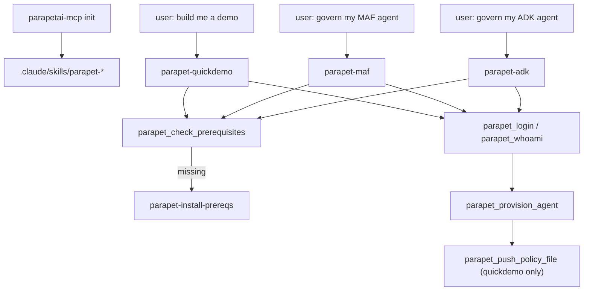

# Skills

`parapetai-mcp init` installs four Claude Code skills into
`.claude/skills/`. Each is a `SKILL.md` that tells an agent (Claude Code,
or any other MCP client that reads skills) exactly which `parapet_*`
[tools](mcp-tools.md) to call, in what order, and what never to do — they
are not separate binaries, just structured instructions plus (for
`parapet-quickdemo`) packaged project templates.

## `parapet-maf`

Use when: you want Parapet added to an **existing** project that already
uses Microsoft Agent Framework (`agent_framework`) — governing an agent
that's already there, provisioning a Parapet agent for it, or wiring up
`parapetai-agent[maf]` env vars.

It checks for `from agent_framework...` imports before applying anything,
authenticates, provisions an agent via `parapet_provision_agent`, and
instruments the codebase — swapping in `GovernedAgent`/`build_middleware()`
and wiring the resulting `agent_id`/`agent_secret`/`control_plane_url`
into the project's env config.

For a Google ADK project, use `parapet-adk` instead — the instrumentation
procedure is genuinely different, not just a naming difference.

## `parapet-adk`

Mirror of `parapet-maf` for an existing **Google ADK** (`google.adk`)
codebase: checks for `google.adk` imports first, then provisions and
instruments with `GovernedRunner`/`build_plugin()`.

## `parapet-quickdemo`

Use when: there's **no existing project** — "build me a Parapet demo",
"show me governance in action", "generate an example governed agent".

Generates a small, self-contained, runnable project from packaged
templates demonstrating identity-based tool access: two people in
different orgs (Tony in Sales, Sally in HR) share one agent with two
tools, and a Cedar policy scoped to `org` lets each of them reach only
their own tool. Runs against a mock model by default (no API key needed)
and a real Parapet control plane behind it, so the allow/deny decisions
and audit trail are real and clickable — not simulated. Also supports a
fully local mode (`PARAPETAI_MODE=local`, no control plane at all) for
fast policy iteration; see the generated project's own README for the
toggle.

Distinct from `parapet-adk`/`parapet-maf`, which retrofit an existing
project — this one creates a new one from nothing, in a directory you
name.

## `parapet-install-prereqs`

Use when: `parapet_check_prerequisites` (or another skill about to run
it) reports something missing — Python 3.12+, `pipx`, or `uv` not on
`PATH`.

Calls `parapet_check_prerequisites`, reports each failing check's
`detail` and `install_cmd`, and **asks before running each install
command, one at a time** — never installs anything without explicit
per-step approval. On macOS, Homebrew has to succeed before `pipx`/`uv`'s
own install commands will, so ordering matters and this skill enforces
it.

## How they fit together

Every skill is careful about two things that show up repeatedly in their
instructions: never print an agent secret, CLI token, or the contents of
`~/.parapet/credentials.json` into chat once it's written to disk; and
never suggest disabling fail-closed defaults or weakening a policy to make
something "just work" — a denial is the product working, not a bug to
route around.
